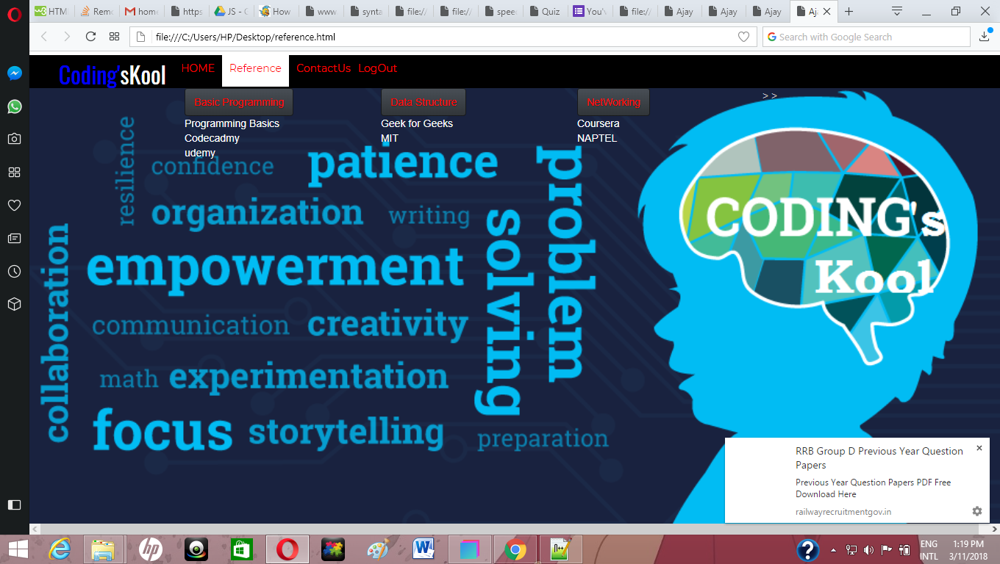

# Coding-sKool
This is a complete desktop application created for self evaluation of coding skills.This application not only focuses on pratical application of programming skills of students but also their theoretical knowlegde of computer science.Hence the students can evaluate themselves and work on their weak areas 
 

## KEY FEATURES
1)QUIZES THAT TEST THEIR FUNDAMENTALS OF COMPUTER SCIENCE
2)SPEED TEST TO TEST STUDENTS TYPING SPEED
3)ACCURACY TEST TO TEST THE CORRECTNESS OF CODE

### TECHNOLOGIES USED

1)FLASK FRAMEWORK FOR BACKEND
2)HTML CSS JS FOR FRONTEND

### Installing
https://github.com/Stevert/Coding-sKool.git
Open codingskools.py

### DEMO

.png)

## License

This project is licensed under the MIT License - see the [LICENSE.md](LICENSE.md) file for details
